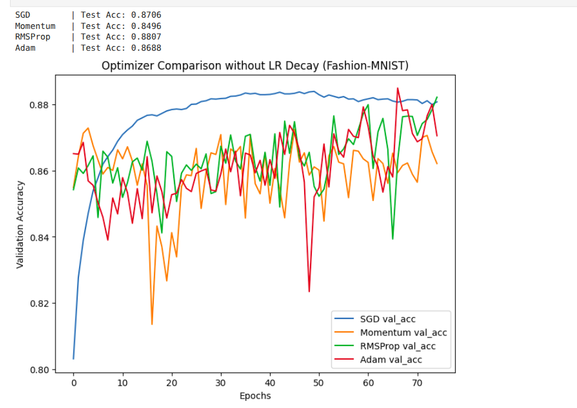
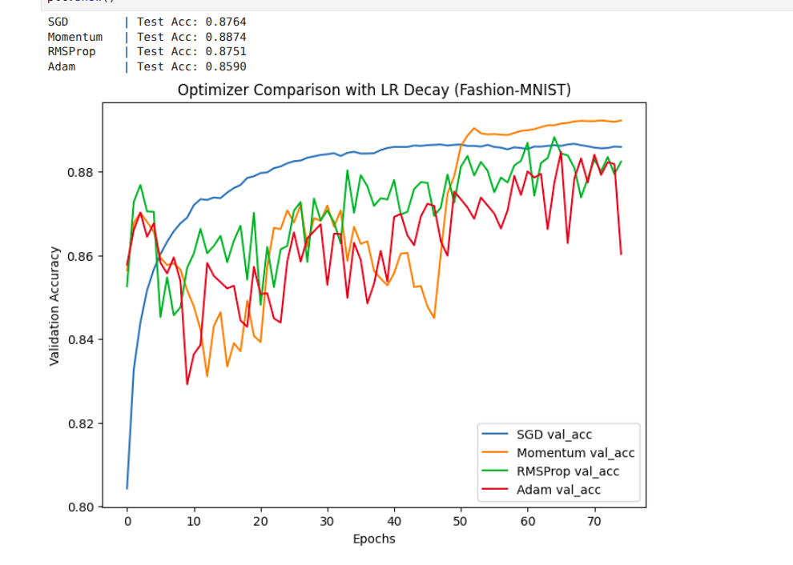
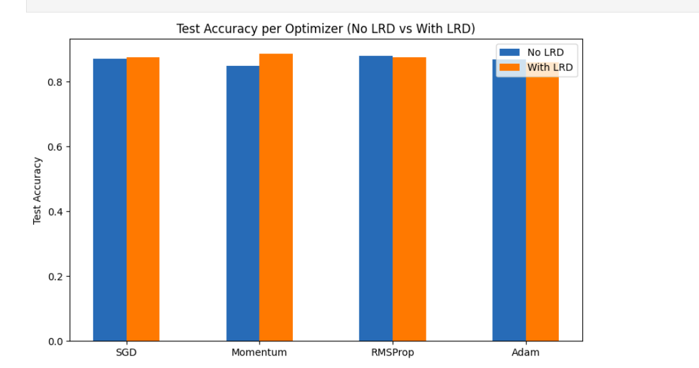
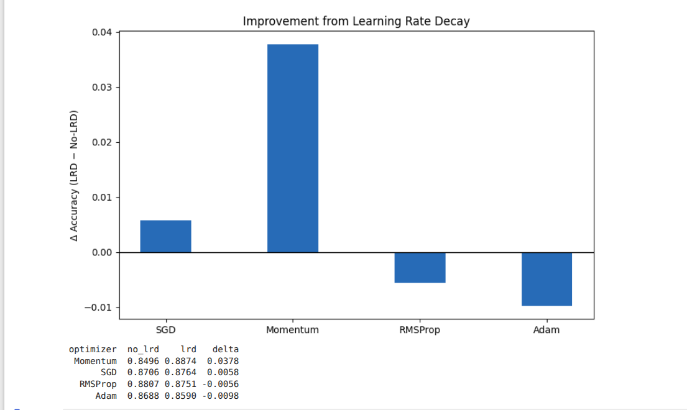

<<<<<<< HEAD

# Optimizer Comparison on Fashion-MNIST

This project explores the effect of different optimization algorithms on training a Multi-Layer Perceptron (MLP) using the [Fashion-MNIST dataset](https://github.com/zalandoresearch/fashion-mnist).  
The experiments are conducted **with and without learning rate decay (LRD)** to highlight how optimizers behave under different training setups.

---

## Setup

- **Dataset:** Fashion-MNIST (60,000 training, 10,000 test images, 10 classes)  
- **Model Architecture:**  
  - Input: 784 (flattened 28x28 grayscale image)  
  - Hidden layers: 256 → 128  
  - Output: 10 (softmax)  
- **Regularization:**  
  - L2 applied only for SGD/Momentum (`1e-4`)  
  - Batch Normalization in all hidden layers  
  - No dropout in baseline runs  
- **Training:**  
  - Epochs: 75  
  - Batch size: 128  
  - Loss: categorical cross-entropy  
  - Metrics: accuracy  

---

## Optimizers Compared

- SGD (lr=0.01)  
- Momentum (lr=0.01, momentum=0.9)  
- RMSProp (lr=0.001)  
- Adam (lr=0.001)

---

## Results (Without Learning Rate Decay)

### Test Accuracy
| Optimizer | Test Accuracy |
|-----------|---------------|
| SGD       | 0.8706 |
| Momentum  | 0.8496 |
| RMSProp   | 0.8807 |
| Adam      | 0.8688 |

### Validation Accuracy Curves

**Observations:**
- **SGD**: Smooth, stable convergence, ~87% accuracy.  
- **Momentum**: Underperformed at this learning rate (~85%).  
- **RMSProp**: Best performance (~88.1%) but validation accuracy was noisy.  
- **Adam**: ~86.9%, comparable to SGD, also noisy.

---

## 📊 Results (With Learning Rate Decay)

### Test Accuracy
| Optimizer | Test Accuracy |
|-----------|---------------|
| SGD       | 0.8764 |
| Momentum  | 0.8874 |
| RMSProp   | 0.8751 |
| Adam      | 0.8590 |

### Validation Accuracy Curves

**Observations:**
- **SGD**: Slight improvement with decay (~+0.6%).  
- **Momentum**: Major boost, improving from 0.85 → 0.887 (+3.7%).  
- **RMSProp**: Performance essentially unchanged (~0.88).  
- **Adam**: Slightly worse with decay (~−1%).  

---

## 🔄 Comparison (No-LRD vs LRD)

| Optimizer | No-LRD Acc | LRD Acc | Δ (Improvement) |
|-----------|------------|---------|-----------------|
| SGD       | 0.8706     | 0.8764  | +0.6% |
| Momentum  | 0.8496     | 0.8874  | **+3.7%** |
| RMSProp   | 0.8807     | 0.8751  | −0.6% |
| Adam      | 0.8688     | 0.8590  | −1.0% |

---

## Conclusions

- **Classical optimizers (SGD, Momentum)** benefit the most from LR decay.  
  - Momentum especially improved, gaining nearly +4% accuracy.  
- **Adaptive optimizers (Adam, RMSProp)** showed little to no improvement.  
  - Adam slightly worsened, highlighting that external LR decay isn’t always helpful when the optimizer already adapts its step size.  
- **Overall:** LR decay is crucial for SGD-type methods, while adaptive optimizers are more robust without it.

---

## Next Steps
- Experiment with different LR decay strategies (exponential, cosine).  
- Add dropout regularization for further comparison.  
- Extend experiments to deeper CNNs on more realistic Datasets.

